<!--
  Most of this page is drawn by code:
    • assets/ — hero, toolbox and contact button, rendered from generator/profile.json
    • stats and project cards — redrawn daily from live GitHub data by
      .github/workflows/profile.yml and served from the `output` branch
  See generator/README.md for how it all fits together.
-->

<a href="https://github.com/ManasvinYadav">
  <picture>
    <source media="(prefers-color-scheme: dark)" srcset="assets/hero-dark.svg">
    <source media="(prefers-color-scheme: light)" srcset="assets/hero-light.svg">
    
  </picture>
</a>

<p align="center">
  <a href="#about"><samp>about</samp></a> &nbsp;·&nbsp;
  <a href="#toolbox"><samp>toolbox</samp></a> &nbsp;·&nbsp;
  <a href="#activity"><samp>activity</samp></a> &nbsp;·&nbsp;
  <a href="#projects"><samp>projects</samp></a> &nbsp;·&nbsp;
  <a href="#contact"><samp>contact</samp></a>
</p>

### <samp>~/about</samp>

```go
package main

import "fmt"

type Developer struct {
    Name, Role, Based string
    Focus             []string
    Philosophy        string
}

func main() {
    me := Developer{
        Name:       "Manasvin Yadav",
        Role:       "Student · part-time larper",
        Based:      "India",
        Focus:      []string{"Go backends", "full-stack web", "modern tooling"},
        Philosophy: "clean code, high performance, robust engineering",
    }
    fmt.Printf("Hi, I'm %s. Thanks for stopping by!\n", me.Name)
}
```

### <samp>~/toolbox</samp>

<picture>
  <source media="(prefers-color-scheme: dark)" srcset="assets/stack-dark.svg">
  <source media="(prefers-color-scheme: light)" srcset="assets/stack-light.svg">
  
</picture>

### <samp>~/activity</samp>

<a href="https://github.com/ManasvinYadav">
  <picture>
    <source media="(prefers-color-scheme: dark)" srcset="https://raw.githubusercontent.com/ManasvinYadav/ManasvinYadav/output/overview-dark.svg">
    <source media="(prefers-color-scheme: light)" srcset="https://raw.githubusercontent.com/ManasvinYadav/ManasvinYadav/output/overview-light.svg">
    
  </picture>
</a>

<p align="center">
  <a href="https://github.com/ManasvinYadav?tab=repositories"><picture><source media="(prefers-color-scheme: dark)" srcset="https://raw.githubusercontent.com/ManasvinYadav/ManasvinYadav/output/languages-dark.svg"><source media="(prefers-color-scheme: light)" srcset="https://raw.githubusercontent.com/ManasvinYadav/ManasvinYadav/output/languages-light.svg"></picture></a>
  <a href="https://github.com/ManasvinYadav?tab=repositories"><picture><source media="(prefers-color-scheme: dark)" srcset="https://raw.githubusercontent.com/ManasvinYadav/ManasvinYadav/output/highlights-dark.svg"><source media="(prefers-color-scheme: light)" srcset="https://raw.githubusercontent.com/ManasvinYadav/ManasvinYadav/output/highlights-light.svg"></picture></a>
</p>

<picture>
  <source media="(prefers-color-scheme: dark)" srcset="https://raw.githubusercontent.com/ManasvinYadav/ManasvinYadav/output/snake-dark.svg">
  <source media="(prefers-color-scheme: light)" srcset="https://raw.githubusercontent.com/ManasvinYadav/ManasvinYadav/output/snake-light.svg">
  
</picture>

### <samp>~/projects</samp>

<!-- projects:start -->
<p align="center">
  <a href="https://github.com/ManasvinYadav/Lucid"><picture><source media="(prefers-color-scheme: dark)" srcset="https://raw.githubusercontent.com/ManasvinYadav/ManasvinYadav/output/project-1-dark.svg"><source media="(prefers-color-scheme: light)" srcset="https://raw.githubusercontent.com/ManasvinYadav/ManasvinYadav/output/project-1-light.svg"></picture></a>
  <a href="https://github.com/ManasvinYadav/swrm"><picture><source media="(prefers-color-scheme: dark)" srcset="https://raw.githubusercontent.com/ManasvinYadav/ManasvinYadav/output/project-2-dark.svg"><source media="(prefers-color-scheme: light)" srcset="https://raw.githubusercontent.com/ManasvinYadav/ManasvinYadav/output/project-2-light.svg"></picture></a>
  <a href="https://github.com/ManasvinYadav/lantern"><picture><source media="(prefers-color-scheme: dark)" srcset="https://raw.githubusercontent.com/ManasvinYadav/ManasvinYadav/output/project-3-dark.svg"><source media="(prefers-color-scheme: light)" srcset="https://raw.githubusercontent.com/ManasvinYadav/ManasvinYadav/output/project-3-light.svg"></picture></a>
  <a href="https://github.com/ManasvinYadav/lantern-react"><picture><source media="(prefers-color-scheme: dark)" srcset="https://raw.githubusercontent.com/ManasvinYadav/ManasvinYadav/output/project-4-dark.svg"><source media="(prefers-color-scheme: light)" srcset="https://raw.githubusercontent.com/ManasvinYadav/ManasvinYadav/output/project-4-light.svg"></picture></a>
</p>
<!-- projects:end -->

### <samp>~/contact</samp>

<p align="center">
  <a href="mailto:manasvinyadav@icloud.com">
    <picture>
      <source media="(prefers-color-scheme: dark)" srcset="assets/contact-dark.svg">
      <source media="(prefers-color-scheme: light)" srcset="assets/contact-light.svg">
      
    </picture>
  </a>
</p>

<p align="center">
  <sub>Cards are redrawn every day from live GitHub data by a small Go program in <a href="generator"><code>generator/</code></a>.</sub>
  <br><br>
  
</p>
